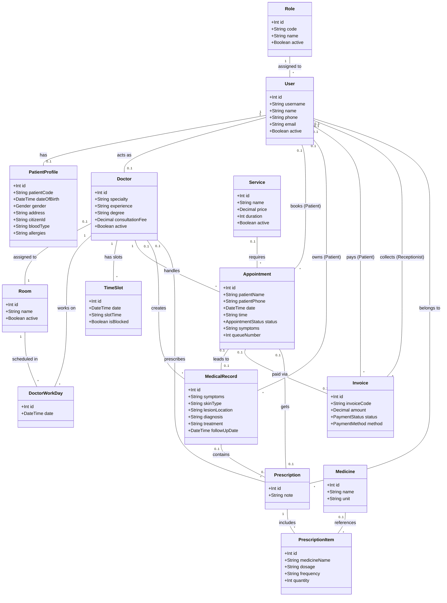

# Biểu đồ lớp (Class Diagram) - Hệ thống VietSkin

Dưới đây là biểu đồ lớp thể hiện các thực thể (entities) và mối quan hệ giữa chúng, được trích xuất trực tiếp từ cấu trúc cơ sở dữ liệu (`schema.prisma`).

