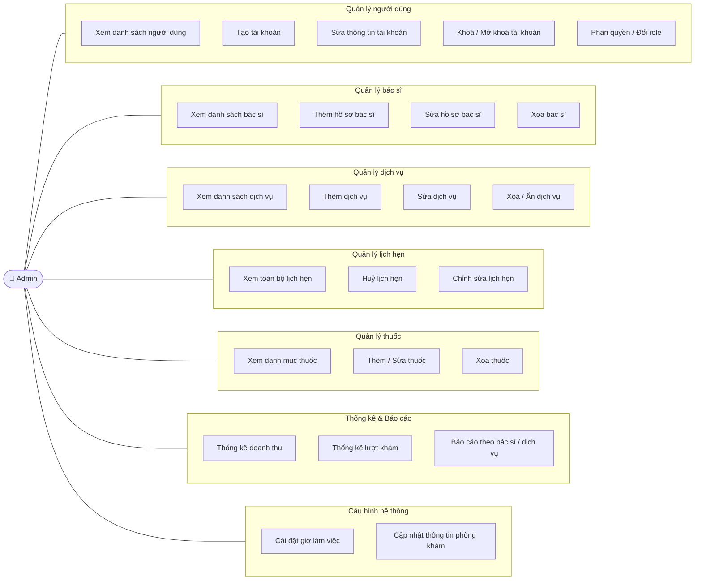

# Use Case Diagram — Role: Admin

## Tóm tắt use case theo nhóm

| Nhóm | Số UC | Mức độ ưu tiên |
|------|-------|----------------|
| Quản lý người dùng | 5 | Cao |
| Quản lý bác sĩ | 4 | Cao |
| Quản lý dịch vụ | 4 | Cao |
| Quản lý lịch hẹn | 3 | Trung bình |
| Quản lý thuốc | 3 | Trung bình |
| Thống kê & Báo cáo | 3 | Trung bình |
| Cấu hình hệ thống | 2 | Thấp |
| **Tổng** | **24** | |
